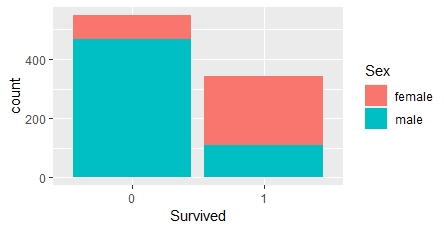

# TITANIC - MACHINE LEARNING FROM DIASATER ( R PRACTICE )
* Exploratory Data Analysis
  * Variables
* Data Processing
  * One-hot-encoding
  * Missing Value
  * Standardized
  * Pincipal Component Analysis
* Modeling
  * Logistic Regression
  * Decision Tree
  * Randon Forest
* Evaluation
* Result

## EXPLORATORY DATA ANALYSIS
### Variables
| Variable | Definition | Key | Class |
|:-----:|:------|:------|:------|
| Survival   |  是否存活  |   0 = No, 1 = Yes | int |
| pclass   |  船票等級  |   1 = 1st, 2 = 2nd, 3 = 3rd | int |
| sex   |  性別  |    | Factor |
| Age   |  年齡  |    | num |
| sibsp   |  兄弟或伴侶也在船上的數量  |    | int |
| parch   |  父母或子女也在船上的數量  |    | int |
| ticket   |  船票號碼  |    | Factor |
| fare   |  乘客費用  |    | num |
| cabin   |  船艙號碼  |    | Factor |
| embarked   |  登船的港口  |   C = Cherbourg, Q = Queenstown, S = Southampton | Factor |

* Continuous Variable: Age / sibsp / parch / fare

|  | Age | sibsp | parch | fare |
|---|:---:|:---:|:---:|:---:|
|Min.|0.42|0|0|0|
|1st Qu.|20.12|0|0|79.1|
|Median|28|0|0|14.45|
|Mean|29.7|0.523|0.382|32.2|
|3rd Qu.|38|1|0|31|
|Max.|80|8|6|512.33|
|NA's|177|0|0|0|

#### Age

年齡的分布趨近於常態分佈，平均年齡為29.7歲，在65歲以上的部分存在少數離群值，但整體來看不影響分布情形。
#### SibSp

#### Parch

#### Fare

兄弟或伴侶也在船上的數量、父母或子女也在船上的數量以及乘客費用的分布皆呈現右偏的情形，而在分別觀察存活人數及死亡人數的分布後，兩者間並沒有存在著明顯不同的分布。

* Categorical Variable : Survival / pclass / sex / ticket / cabin / embarked

#### Pclass

#### Sex

#### Embarked

#### Survival

由各船票等級佔存活及死亡的人數比例當中可以發現，第三等級的人數佔整體人數超過一半，且死亡率相較於其他兩級有顯著的增加。

由各性別佔存活及死亡的人數比例當中可以發現，男性人數佔比超過一半，且男性的死亡率明顯高於女性。

由各登船港口佔存活及死亡的人數比例當中可以發現，在Southampton登船的人數佔整體大約三分之二，但在各登船港口間的死亡率並無顯著不同。

## DATA PROCESSING
### Missing Value
||Age|Embarked|
|:--:|:--:|:--:|
|NA's|177|2|
|Mean|**29.7**||
|Median|28||
|Mode||**S**|

* Age

我們透過其他乘客的平均數來填補遺失值，以確保在平均數及變異數不變的情況下，年齡的變數將維持在原本的分配上。

* Embarked

登船港口的資料中僅有兩筆遺失值，但兩筆資料皆屬於存活人口，故不考慮刪除，而各港口中又以Southampton的人數最多，故以Southampton來填補遺失值，保留整體資料趨勢。

### One-Hot-Encoding
* Sex

將原本的female/male分別改成0/1
* Pclass

將原本的1/2/3分拆成兩個變數pclass_1和pclass_2( 1:(1,0) / 2:(0,1) / 3:(0,0) )
* Embarked

將原本的C/Q/S分拆成兩個變數embarked_C和embarked_Q( C:(1,0) / Q:(0,1) / S:(0,0) )
### Standardized

將Age/Fare/SibSp/Parch四個變數分別進行標準化(Z標準化)
### Principal Component Analysis

## MODELING
### Logistic Regression
|Set|Training|Validation|Testing|
|:--:|:--:|:--:|:--:|
|fold1|0.81|0.72|0.83|
|fold2|0.82|0.82|0.73|
|fold3|0.80|0.80|0.81|
|fold4|0.80|0.83|0.79|

### Decision Tree
|Set|Training|Validation|Testing|
|:--:|:--:|:--:|:--:|
|fold1|0.84|0.73|0.83|
|fold2|0.83|0.81|0.72|
|fold3|0.83|0.78|0.80|
|fold4|0.82|0.85|0.76|

### Random Forest
|Set|Training|Validation|Testing|
|:--:|:--:|:--:|:--:|
|fold1|0.83|0.79|0.81|
|fold2|0.82|0.84|0.78|
|fold3|0.82|0.80|0.83|
|fold4|0.83|0.85|0.82|

## EVALUATION

## RESULT

## REFERENCE
<https://www.kaggle.com/c/titanic/overview>

